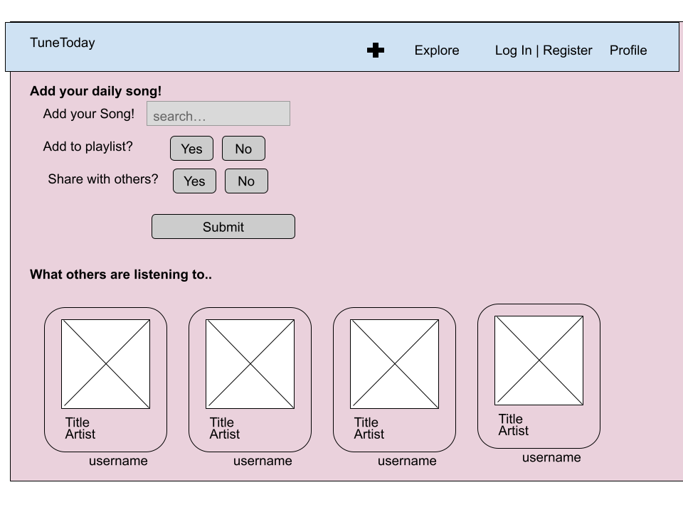
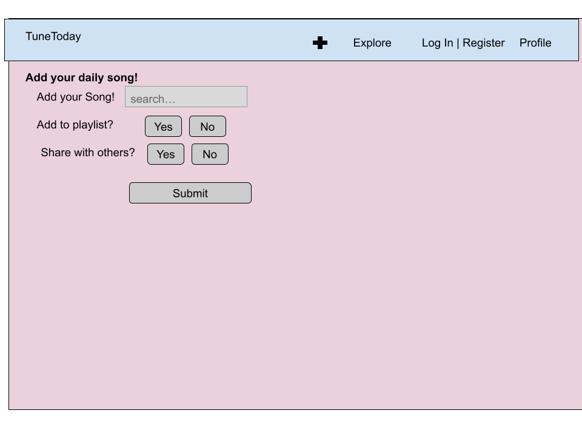
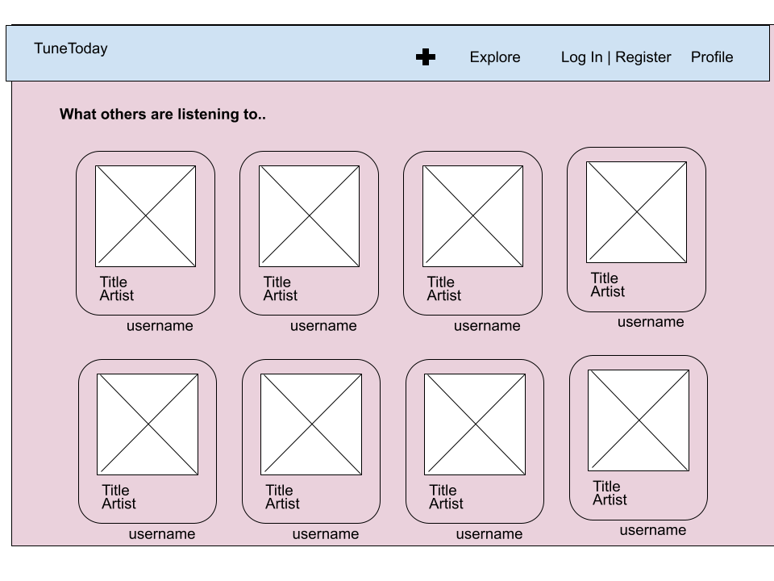
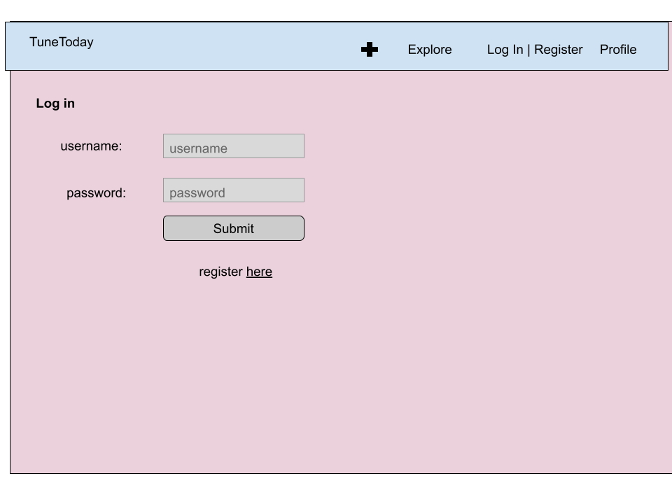
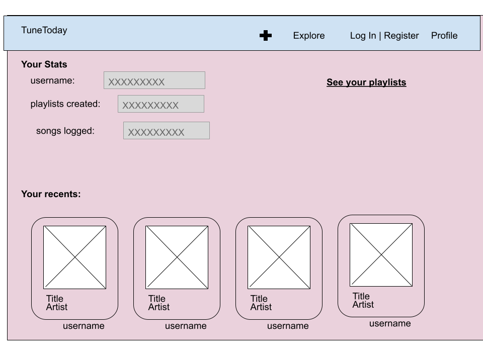
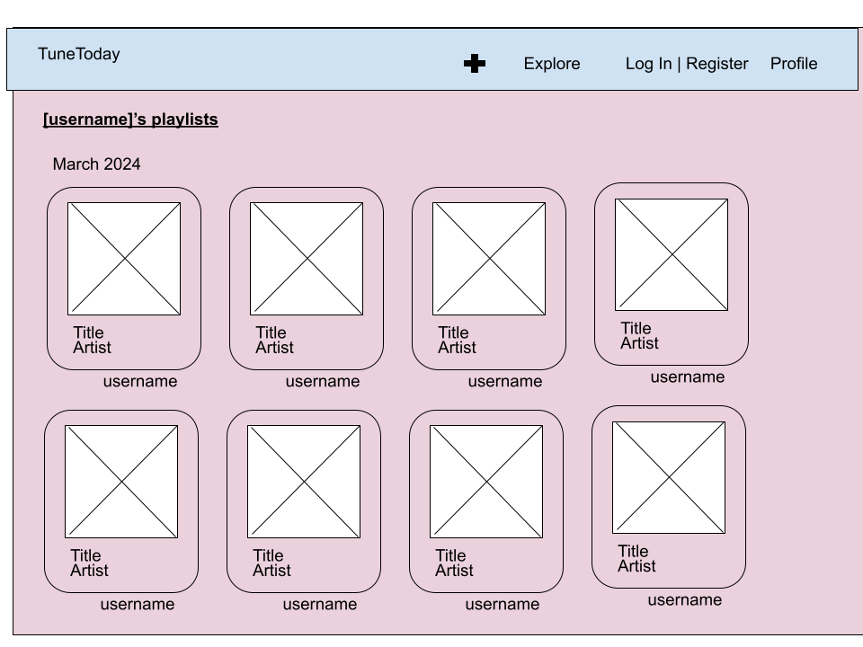

<<<<<<< HEAD
# Tune Today 

## Overview

Music is a huge part of our lives. It uplifts our mood, boosts our creativity and fills us with positive energy. Often, between school and homework, we forget to enjoy our simple daily pleasures, like a song we're obsessed with. Tune Today was created for this purpose--to blend music and friendships, and to remind us of our day-to-day moments of happiness.

Tune Today is a web app that allows users to record a song that characterizes their day. Users can register and log in, then see the Song of the Day for other users and give their input with a reaction emoji or comment.


## Data Model

The application will store Users and Songs

* users can add as many songs as they would like
* users can view songs added by other users
* in the future, I will add a more sophisticated Playlist feature, where you can organize the songs you have added.

An Example User:

```javascript
{
  username: "musician",
  hash: // a password hash,
  playlists: // an array of references to playlists
  songOfTheDay: //selected song of the day, empty if unselected
}
```

An Example Playlist with Embedded Songs:

```javascript
{
  creator: "musician" // a reference to a User object
  name: "March 2024" // records month created, name of playlist is date created
  songs: [
    { name: "Drive You Home", artist: "Jackson Wang", year: "2021", album:"Drive You Home", dateRecorded: "1"},
    { name: "Breathe", artist: "Yeat", year: "2024", album: "2093 (P2)", dateRecorded: "2"},
    { name: "St. Tropez", artist: "J. Cole", year: "2014", album: "2014 Forest Hills Drive", dateRecorded: "3"},
  ],
  
}
```


## [Link to Commented First Draft Schema](db.mjs) 

## Wireframes

/index - home page, can access other pages


/index/add - add your daily song



/index/explore - see what others are listening to



/index/register - add your account


/index/login - log in to your account



/index/profile - see your account stats



/index/playlists - see all your playlists



## [Link to Site map](documentation/sitemap.png)

## User Stories or Use Cases

1. as non-registered user, I can register a new account with the site
2. as a user, I can log in to the site
3. as a user, I can add a song as my song of the day
4. as a user, I can view others' songs of the day/playlist
5. As a user, I can search for songs other users have added as their song of the day.

## Research Topics

* (6 points) React
    * I will be using the React Framework to build a responsive framework and engaging UI.
* (2 points) Bootstrap
    * I will be using Bootstrap to customize the frontend of my web app.
* (2 points) Axios Library
    * I will be using Axios to interface with REST API. It is an alternative to Fetch, and is used to send asynchoronous HTTP requests to REST endpoints.
    * https://www.digitalocean.com/community/tutorials/react-axios-react

10/10 total required points


## [Link to Initial Main Project File](app.mjs) 

# Research
* So far I have created react app in /client
  * It has functioning frontend that creates a form that sends it to backend
* Milestone 3 progress:
  * I have gotten more used to react, added another form using react. 
  * I am still facing issues with deploying, but code works fine locally.
  * I have done research on Spotify api, and will begin using it after I have set up all the other pages & user logins
    * the website is pretty useful, but i think i will follow [this](https://www.youtube.com/watch?v=1PWDxgqLmDA) youtube tutorial for MERN stack
* Final project updates:
    * I was facing difficulty integrating the Spotify API, and given the time constraint, decided to swap the Spotify API integration portion of the additional requirements (external API, 6 pts) with my use of Bootstrap (2) and Axios library (2).
        * Link for Axios documentation: [click here](https://www.digitalocean.com/community/tutorials/react-axios-react)
    * My 3 forms are: login/registration, "Add song" form, and "Search song" form. 
        * to log in, username: aneri, password: qwertyuiop
    * I used map twice in my home.js to filter the song grid for the search feature.
    * I have 3 mongoose schemas, but only ended up using 2 due to bugs. I use User and Song schemas.

## Annotations / References Used

1. [how to use react (used this plus classnotes)](https://react.dev/blog/2023/03/16/introducing-react-dev)
2. [how to use bootstrap, guided my use of bootstrap](https://getbootstrap.com/docs/5.3/getting-started/introduction/)
3. [navbar from bootstrap, customized to match the theme of my website](https://react-bootstrap.netlify.app/docs/components/navbar/)
4. [how to create a multi-page webapp with react](https://www.google.com/search?sca_esv=c23ff5f34ecefdf6&sca_upv=1&rlz=1C1RXQR_enUS1021US1021&sxsrf=ACQVn0_GLrQfVaAcsPtaxVKiURIw9H-hsg:1714081211796&q=how+to+make+multiple+pages+in+react&tbm=vid&source=lnms&prmd=visnbmtz&sa=X&sqi=2&ved=2ahUKEwig2_qNqt6FAxV5MVkFHVfOAhEQ0pQJegQIDhAB&biw=1500&bih=865&dpr=2#fpstate=ive&vld=cid:dc6a38f5,vid:xMNhDf5-hvk,st:0)
    * I used this as a guide for developing the several different pages I have on my web app.
5. [localstorage, learned to use localstorage to maintain loggedin state across my React components] (https://blog.logrocket.com/localstorage-javascript-complete-guide/)
=======
# tune-today
>>>>>>> aac123a844a232218f1740d574b62d11313446d2
